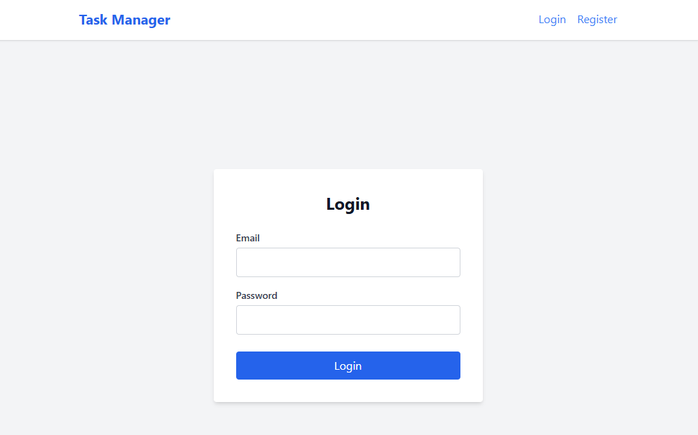

# Task Management Application

A simple Task Management Application built with Flask (Backend) and React (Frontend).

## Features
- User Registration & Login (JWT Authentication)
- Create, Read, Update, Delete (CRUD) Tasks
- Task Status Management (Pending, In Progress, Done)
- Protected Routes
- Responsive UI

## Getting Started

### Cloning the Repository
```bash
git clone https://github.com/ahmedsamir45/Rawmart_Task.git
cd Rawmart_Task
```

## Setup Instructions

### Prerequisites
- Node.js (for Frontend)
- Python 3.8+ (for Backend)

### Backend Setup
1. Navigate to the backend directory:
   ```bash
   cd backend
   ```
2. Create a virtual environment (optional but recommended):
   ```bash
   python -m venv venv
   source venv/bin/activate  # On Windows: venv\Scripts\activate
   ```
3. Install dependencies:
   ```bash
   pip install -r requirements.txt
   ```
4. Run the server:
   ```bash
   python app.py
   ```
   The backend runs on `http://localhost:5000`.

### Frontend Setup
1. Navigate to the frontend directory:
   ```bash
   cd frontend
   ```
2. Install dependencies:
   ```bash
   npm install
   ```
3. Run the development server:
   ```bash
   npm run dev
   ```
   The frontend runs on `http://localhost:3000`.

### Docker Setup (Recommended)
1. Ensure Docker and Docker Compose are installed.
2. Run the application stack:
   ```bash
   docker-compose up --build
   ```
3. Access the application:
   - Frontend: `http://localhost:3000`
   - Backend API: `http://localhost:5000`
   - Swagger Docs: `http://localhost:5000/apidocs`

## Bonus Features
- **Pagination**: Task list is paginated (5 per page).
- **Docker**: Run `docker-compose up` to launch the entire stack.
- **Tests**: Run `pytest` in `backend/` to run automated tests.
- **Swagger**: API Documentation available at `/apidocs`.

## Running Tests
To execute the backend test suite (covering Auth, CRUD, and Pagination):
1. Navigate to the backend directory: `cd backend`
2. Ensure your virtual environment is active.
3. Run pytest:
   ```bash
   pytest
   ```
   *Note: Ensure `pytest` is installed (`pip install pytest`).*

## API Endpoints

### Auth
- `POST /api/auth/register` - Register a new user
- `POST /api/auth/login` - Login and get token

### Tasks
- `GET /api/tasks/` - Get all tasks for logged in user
- `POST /api/tasks/` - Create a new task
- `PUT /api/tasks/<id>` - Update a task
- `DELETE /api/tasks/<id>` - Delete a task

## Assumptions
- SQLite is used as the database for simplicity.
- Port 5000 is available for backend.
- Port 3000 is available for frontend.

## Screenshots

### Login


### Register


### Task Dashboard


### Pagination


### Swagger Documentation

